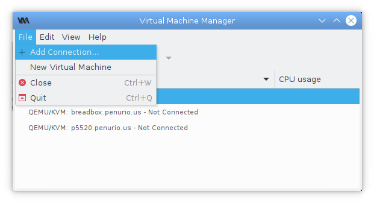
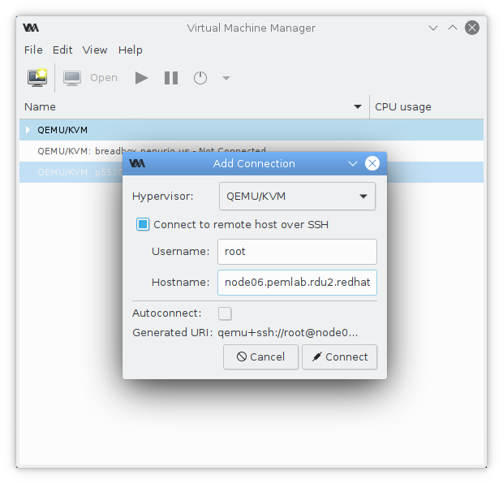
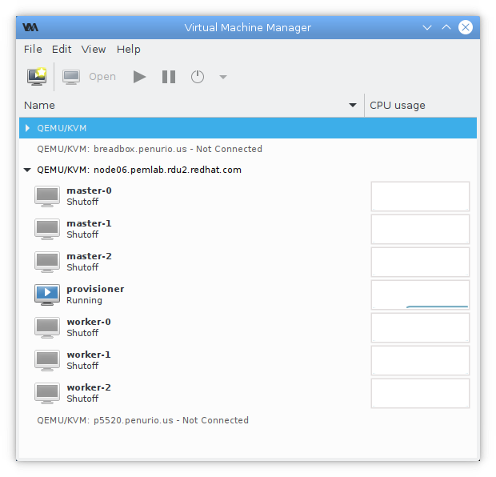
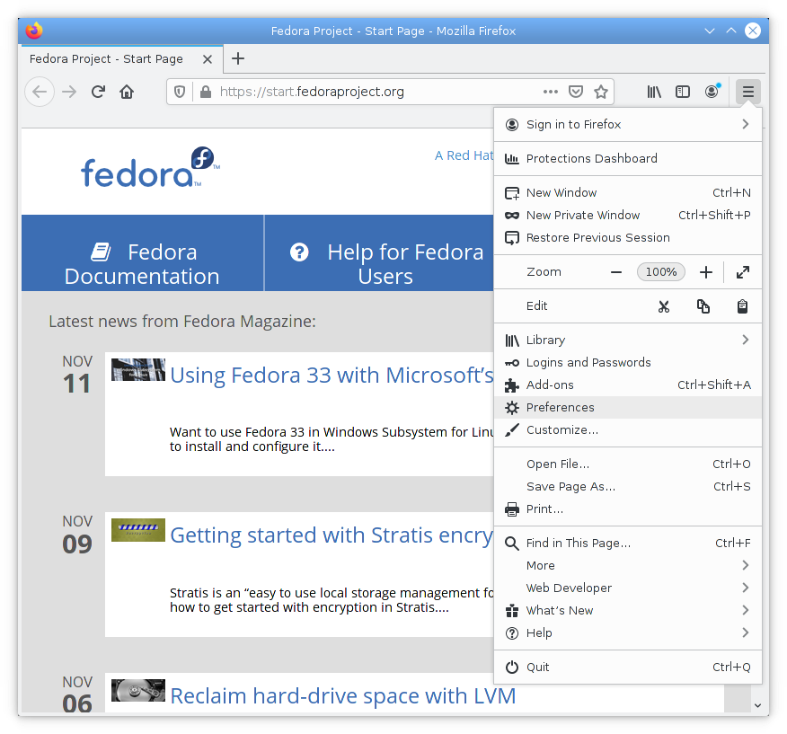
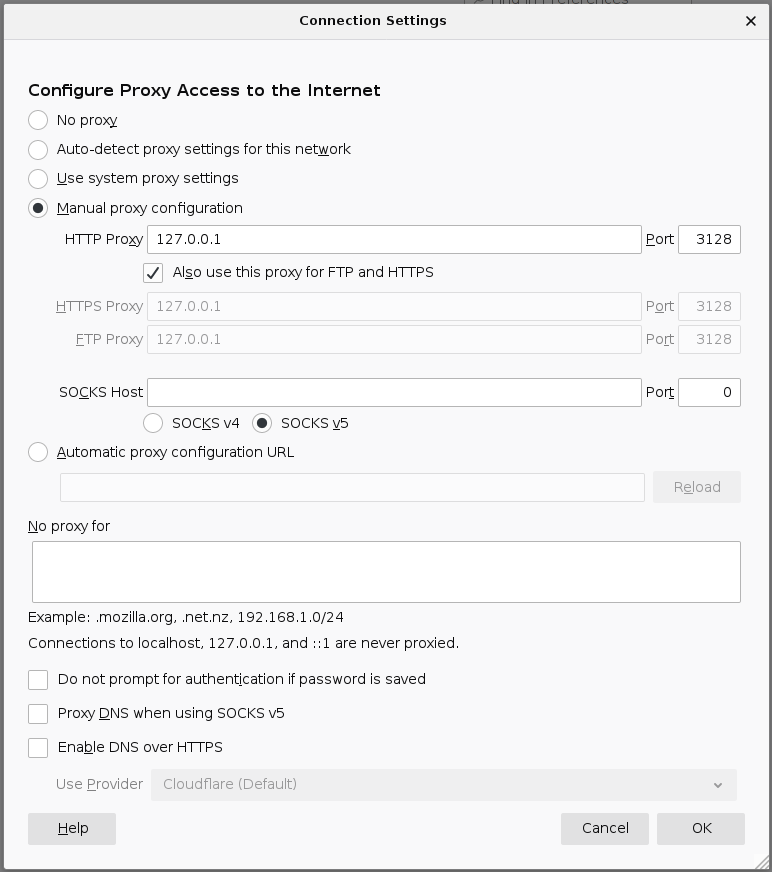

# OpenShift Virtualization 2.5 Hackfest

This document provides instructions for using a hypervisor in the Red Hat Field Product Management
lab for the OpenShift Virtualization (CNV) 2.5 hackfest.

These instructions use the environment variable `NODE` to refer to the hypervisor.  Set this
variable to the fully qualified domain name of your assigned hypervisor.

For example:

```
$ export NODE=node06.pemlab.rdu2.redhat.com
```

## (Optional) Set up SSH key-based authentication

Password-less authentication makes access to the hpervisor more convenient.  It is also required
for `virt-manager` access to the hypervisor.

**NOTE:** All passwords in the lab environment are set to `CNV25h@ck`.

```
$ ssh-copy-id root@${NODE}
/usr/bin/ssh-copy-id: INFO: Source of key(s) to be installed: "/home/pilcher/.ssh/id_rsa.pub"
The authenticity of host 'node06.pemlab.rdu2.redhat.com (10.11.173.26)' can't be established.
ECDSA key fingerprint is SHA256:inctUkcIO4uQYRe5pt3dS8KFfDddZKlovKFnjMQv0JY.
Are you sure you want to continue connecting (yes/no/[fingerprint])? yes
/usr/bin/ssh-copy-id: INFO: attempting to log in with the new key(s), to filter out any that are already installed
/usr/bin/ssh-copy-id: INFO: 1 key(s) remain to be installed -- if you are prompted now it is to install the new keys
root@node06.pemlab.rdu2.redhat.com's password:

Number of key(s) added: 1

Now try logging into the machine, with:   "ssh 'root@node06.pemlab.rdu2.redhat.com'"
and check to make sure that only the key(s) you wanted were added.
```

If you have not previously created an SSH key, use the `ssh-keygen` command to create one.

```
$ ssh-copy-id root@${NODE}
/usr/bin/ssh-copy-id: ERROR: No identities found

$ yes '' | ssh-keygen
Generating public/private rsa key pair.
Enter file in which to save the key (/home/pilcher/.ssh/id_rsa): Created directory '/home/pilcher/.ssh'.
ssh_askpass: exec(/usr/libexec/openssh/ssh-askpass): No such file or directory
ssh_askpass: exec(/usr/libexec/openssh/ssh-askpass): No such file or directory
Your identification has been saved in /home/pilcher/.ssh/id_rsa
Your public key has been saved in /home/pilcher/.ssh/id_rsa.pub
The key fingerprint is:
SHA256:30rOiGoazeJaGMWVphwrnP98THVDCtL+WYrbBjc1FJs pilcher@ian.penurio.us
The key's randomart image is:
+---[RSA 3072]----+
|    ...    ..    |
| ...o. o   oo    |
|..+=  o . +E     |
|.++    . o *     |
|...     S * o    |
| o +   + B .     |
|. + = o = + .    |
| o o.o = B .     |
|..oo..o o +      |
+----[SHA256]-----+
```

## (Optional) Connect `virt-manager` to your hypervisor

Connecting `virt-manager` to your hypervisor provides a convenient way to examine the details of
your OpenShift nodes and view their consoles.

This step requires SSH key-based authentication.

Select the **File** ➤ **Add Connection...** menu item.



Select **Connect to remote host over SSH**, enter the **Hostname:** of your hypervisor, and click
**Connect**.



`virt-manager` will show the virtual machines on your hypervisor.



## Explore your lab environment

Log in to your hypervisor.
All passwords in the environment are set to `CNV25h@ck`.

```
$ ssh -L 3128:localhost:3128 root@${NODE}
```

(This command also creates a tunnel, connecting TCP port 3128 on your local system to the `squid`
proxy on the hypervisor.  This tunnel is required for browser access to the OpenShift console and
any other applications running on the OpenShift cluster.)

Examine the pre-defined virtual machines.

```
[root@localhost ~]# virsh list --all
 Id    Name                           State
----------------------------------------------------
 1     provisioner                    running
 -     master-0                       shut off
 -     master-1                       shut off
 -     master-2                       shut off
 -     worker-0                       shut off
 -     worker-1                       shut off
 -     worker-2                       shut off

[root@localhost ~]# vbmc list
+-------------+---------+-----------------+------+
| Domain name |  Status |     Address     | Port |
+-------------+---------+-----------------+------+
|   master-0  | running | 192.168.123.248 | 623  |
|   master-1  | running | 192.168.123.249 | 623  |
|   master-2  | running | 192.168.123.250 | 623  |
|   worker-0  | running | 192.168.123.251 | 623  |
|   worker-1  | running | 192.168.123.252 | 623  |
|   worker-2  | running | 192.168.123.253 | 623  |
+-------------+---------+-----------------+------+
```

Examine the pre-defined virtual networks.

```
[root@localhost ~]# virsh net-list
 Name                 State      Autostart     Persistent
----------------------------------------------------------
 baremetal            active     yes           yes
 cnv                  active     yes           yes
 provisioning         active     yes           yes

[root@localhost ~]# brctl show
bridge name     bridge id               STP enabled     interfaces
cnv             8000.000000000000       no
metal           8000.feadbeef0000       no              vnet1
prov            8000.feadbeef0500       no              vnet0
```

`dnsmasq` is providing DNS and DHCP services.

```
[root@localhost ~]# cat /etc/dnsmasq.conf
server=10.11.173.1
no-resolv
strict-order
local=/ocp.hackfest/
domain=ocp.hackfest
expand-hosts
domain-needed
local=//
dhcp-range=192.168.123.101,192.168.123.200
dhcp-no-override
dhcp-authoritative
dhcp-lease-max=100
dhcp-option=option:ntp-server,10.11.173.1
dhcp-host=de:ad:be:ef:00:00,192.168.123.1,prov
dhcp-host=de:ad:be:ef:01:00,192.168.123.2,master-0
dhcp-host=de:ad:be:ef:01:01,192.168.123.3,master-1
dhcp-host=de:ad:be:ef:01:02,192.168.123.4,master-2
dhcp-host=de:ad:be:ef:02:00,192.168.123.5,worker-0
dhcp-host=de:ad:be:ef:02:01,192.168.123.6,worker-1
dhcp-host=de:ad:be:ef:02:02,192.168.123.7,worker-2
host-record=prov.ocp.hackfest,192.168.123.1
host-record=master-0.ocp.hackfest,192.168.123.2
host-record=master-1.ocp.hackfest,192.168.123.3
host-record=master-2.ocp.hackfest,192.168.123.4
host-record=worker-0.ocp.hackfest,192.168.123.5
host-record=worker-1.ocp.hackfest,192.168.123.6
host-record=worker-2.ocp.hackrest,192.168.123.7
host-record=api.ocp.hackfest,192.168.123.8
host-record=apps.ocp.hackfest,192.168.123.9
address=/apps.ocp.hackfest/192.168.123.9
```

## Install OpenShift

Optionally, set up SSH key-based authentication to the `kni` user on the provisioning node (`prov`).

Log in as the `kni` user on the provisioning node.

```
[root@localhost ~]# ssh kni@prov
Last login: Thu Nov 12 23:36:08 2020 from 192.168.123.254
```

Download [`install-config.yaml`](https://raw.githubusercontent.com/RHFieldProductManagement/CNV-2.5-hackfest/master/install-config.yaml).

```
[kni@prov ~]$ curl -O https://raw.githubusercontent.com/RHFieldProductManagement/CNV-2.5-hackfest/master/install-config.yaml
  % Total    % Received % Xferd  Average Speed   Time    Time     Time  Current
                                 Dload  Upload   Total   Spent    Left  Speed
100  1462  100  1462    0     0  10750      0 --:--:-- --:--:-- --:--:-- 10750
```

In a web browser, navigate to
[Install on Bare Metal with user-provisioned infrastructure](https://cloud.redhat.com/openshift/install/metal/user-provisioned).
Log in if necessary and find the **Pull secret** section (within **What you need to get started**).
Click on **Copy pull secret**.

On the provisioning node, edit `install-config.yaml` and insert the pull secret between the single
quotes in the second-to-last line of the file.  Be sure to remove any whitespace between the pull
secret and the closing single-quote.

The result should look like this:

```
[kni@prov ~]$ grep pullSecret install-config.yaml | fold -c
pullSecret: '{"auths":{"cloud.openshift.com":{"auth":"b3BlbnNoaWZ0LXJlbGVhc2UtZG
V2K2ljcGlsY2hlcjFlNjV1eTlkNjJibXFtYmludWR1MmF3dWswYzpMNVhRWlQ5SzNDQ0JFWVVaMVdQWU
⋮
hZ283TWVPd3BiUlF2emFFSmwycl9NYmNyU0pTdzB2SW1STTRsOGprXzNqcVVpS1VreE14MHNVNGh6di1
ONnZYdXQ0TEFnQk0yOTRSOXpVRVBsU0ZPQzgxX2NEdDJreWRRa1FsUHd4WWxvRGhB","email":"ipil
cher@redhat.com"}}}'
```

Display the `kni` user's public SSH key.

```
[kni@prov ~]$ cat .ssh/id_rsa.pub
ssh-rsa AAAAB3NzaC1yc2EAAAADAQABAAABgQDmkzAV/xlIfWY8U2b2VVlLqz86ngRu6v6sMjDBAEHW6Ju81wppl363Q31t4Cd+
qz63KGbh9zRMSp8vaB/I/O+GuYL/Qir8ulHsFRkxawPUh0ILKjolVYoZgGQ6P4NttpdIrjq15PP8c0ACY/V63kegh1Comudm76Bj
RB6UwJYr3b2GgH9cCh3hSEgJ/zzF2htixN4i8hhXEgpigh0RvFWg5rzwxECmXOeEBhGPJMEAuBFAOxLsoqK8gVmkdDXbFDI28iHF
HxbQdtZ5hlQtWxfq5I9XBUyyl7FBIS1gEvkfCFBbD9TfZfOOjIfl0tWqXYuOrr1F+2B4LXD4QLOUR4gw4Safxu+rJqvz4uRnW/Xy
GBvXFNJKJa9Llxgap4hymnP2XDJaG1R6uIMBxc/l2LUWKap03ZXQia5enqYDZBdw4drag3VAZky+xMaq79/SyAMWiNw0CBUFf48j
5NUrFS24IfqBDqT4OQcDn+43f+lw8esN3UNRKu058c4+00+3010= kni@prov.ocp.hackfest
```

Edit `install-config.yaml` and insert the SSH key between the single quotes in the last line of the
file.

The result should look like this:

```
[kni@prov ~]$ grep sshKey install-config.yaml | fold -c
sshKey: 'ssh-rsa AAAAB3NzaC1yc2EAAAADAQABAAABgQDmkzAV/xlIfWY8U2b2VVlLqz86ngRu6v6
sMjDBAEHW6Ju81wppl363Q31t4Cd+qz63KGbh9zRMSp8vaB/I/O+GuYL/Qir8ulHsFRkxawPUh0ILKjo
lVYoZgGQ6P4NttpdIrjq15PP8c0ACY/V63kegh1Comudm76BjRB6UwJYr3b2GgH9cCh3hSEgJ/zzF2ht
ixN4i8hhXEgpigh0RvFWg5rzwxECmXOeEBhGPJMEAuBFAOxLsoqK8gVmkdDXbFDI28iHFHxbQdtZ5hlQ
tWxfq5I9XBUyyl7FBIS1gEvkfCFBbD9TfZfOOjIfl0tWqXYuOrr1F+2B4LXD4QLOUR4gw4Safxu+rJqv
z4uRnW/XyGBvXFNJKJa9Llxgap4hymnP2XDJaG1R6uIMBxc/l2LUWKap03ZXQia5enqYDZBdw4drag3V
AZky+xMaq79/SyAMWiNw0CBUFf48j5NUrFS24IfqBDqT4OQcDn+43f+lw8esN3UNRKu058c4+00+3010
= kni@prov.ocp.hackfest'
```

Create the OpenShift manifests.

```
[kni@prov ~]$ mkdir clusterconfigs
[kni@prov ~]$ cp install-config.yaml clusterconfigs/
[kni@prov ~]$ ./openshift-baremetal-install --dir ~/clusterconfigs create manifests
INFO Consuming Install Config from target directory
WARNING Discarding the Openshift Manifests that was provided in the target directory because its …
…dependencies are dirty and it needs to be regenerated
INFO Manifests created in: /home/kni/clusterconfigs/manifests and /home/kni/clusterconfigs/openshift
```

Create the OpenShift cluster.

```
[kni@prov ~]$ ./openshift-baremetal-install --dir ~/clusterconfigs --log-level debug create cluster
DEBUG OpenShift Installer 4.6.3
DEBUG Built from commit a4f0869e0d2a5b2d645f0f28ef9e4b100fa8f779
DEBUG Fetching Metadata...
DEBUG Loading Metadata...
DEBUG   Loading Cluster ID...
DEBUG     Loading Install Config...
DEBUG       Loading SSH Key...
DEBUG       Loading Base Domain...
DEBUG         Loading Platform...
DEBUG       Loading Cluster Name...
DEBUG         Loading Base Domain...
DEBUG         Loading Platform...
⋮
INFO Install complete!
INFO To access the cluster as the system:admin user when using 'oc', …
…run 'export KUBECONFIG=/home/kni/clusterconfigs/auth/kubeconfig'
INFO Access the OpenShift web-console here: https://console-openshift-console.apps.ocp.hackfest
INFO Login to the console with user: "kubeadmin", and password: "HIwcT-eUZBR-PMjuI-AmzL3"
DEBUG Time elapsed per stage:
DEBUG     Infrastructure: 25m41s
DEBUG Bootstrap Complete: 10m42s
DEBUG  Bootstrap Destroy: 13s
DEBUG  Cluster Operators: 35m0s
INFO Time elapsed: 1h11m47s
```

The installation will take approximately 1 hour.

## Access the OpenShift Console

To access the OpenShift console, your browser must be configured to use the proxy server on the
hypervisor (through an SSH tunnel).  These instructions are provided for Mozilla Firefox.

* Open the "hamburger" menu in the upper right corner and select the **Preferences** item (about
  halfway down the menu).



* Scroll down to the bottom of the Preferences tab and click on the **Settings** button in the
  **Network Settings** section.


* Select the **Manual proxy configuration** radio button.

* Set the **HTTP Proxy** to `127.0.0.1`, and set its **Port** to `3128`.

* Select the **Also use this proxy for FTP and HTTPS** checkbox.



* Click the **OK** button.

Enter (or click on) the OpenShift Console URL
([`https://console-openshift-console.apps.ocp.hackfest/`](https://console-openshift-console.apps.ocp.hackfest/)).
You will need to click through 2 certificate warnings (**Advanced...**, scroll down,
**Accept the Risk and Continue**), first for the console application and then for the authentication
application.

After accepting both certificates, the OpenShift Console login screen is displayed.


